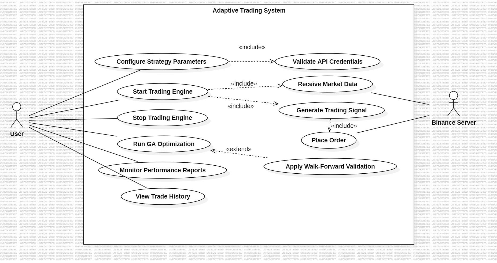
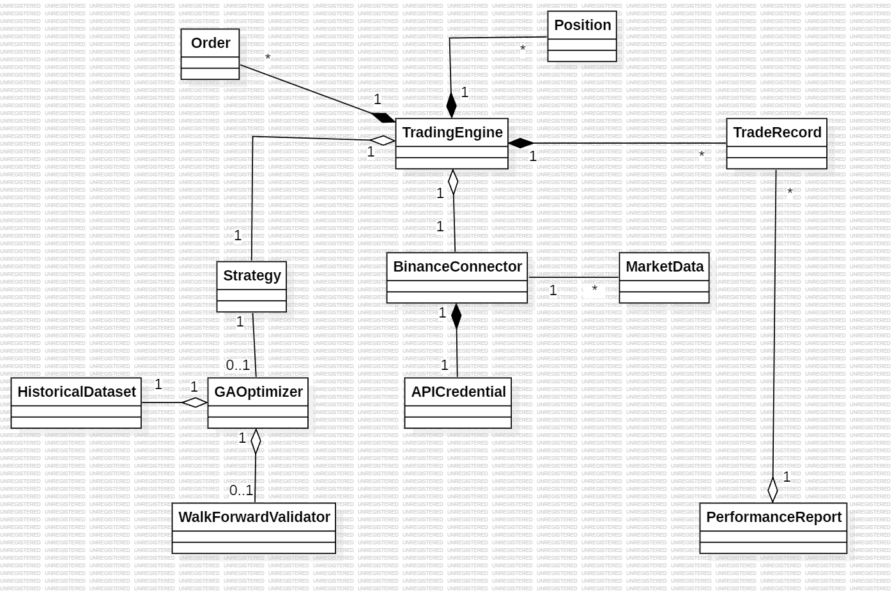
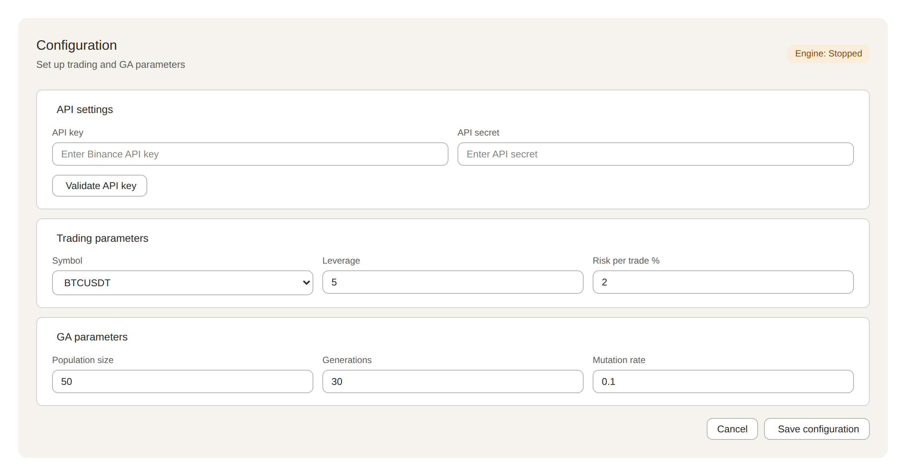
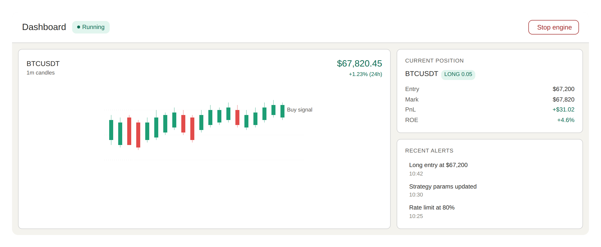
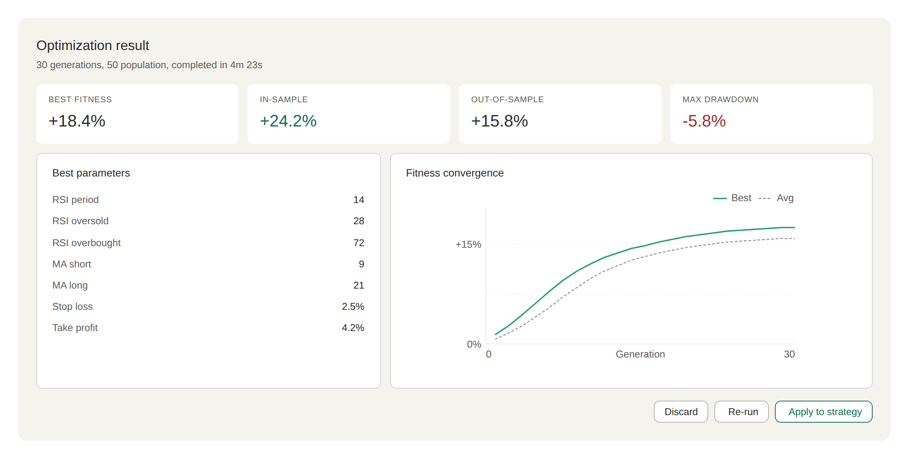
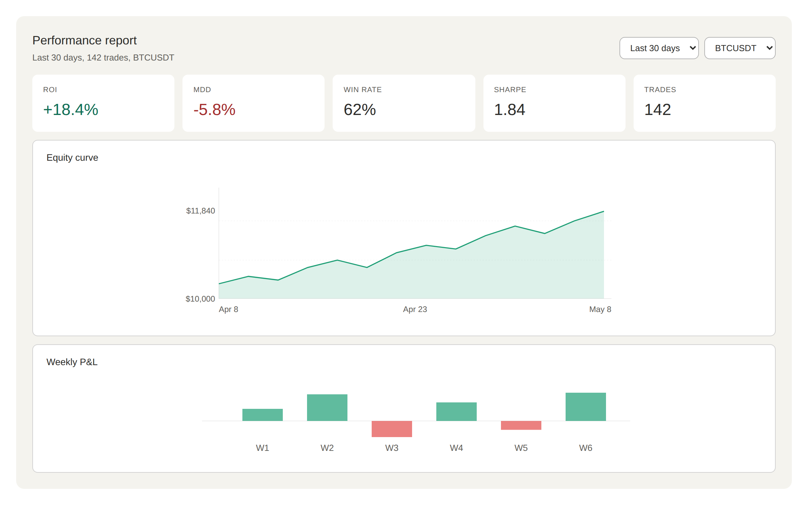
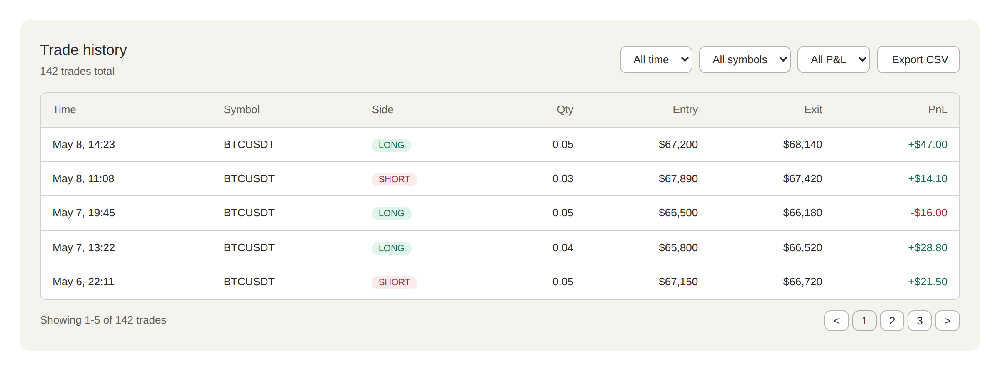

# 2. Analysis

**Project Title: OSS_Design_Adaptive-Trading-System**

### [ Revision history ]
| Date | Version | Description | Author |
| :--- | :--- | :--- | :--- |
| 2026-05-08 | 1.0.0 | Initial Draft | 허주호 |
| 2026-06-05 | 1.1.0 | Update reference to Java tech stack (ta4j) | 허주호 |

---

= Contents =

1. Introduction
2. Use case analysis
   2.1 Use case diagram
   2.2 Use case description
3. Domain analysis
4. User Interface prototype
5. Glossary
6. References

---

## 1. Introduction

본 문서는 **OSS_Design_Adaptive-Trading-System (이하 ATS)** 의 Analysis 단계 산출물임. 직전 Conceptualization 문서에서 정의된 시스템의 비즈니스 목적, 컨텍스트, Use case list, Concept of operations, Problem statement를 출발점으로 삼아 시스템이 **‘무엇을 하는가(What)’** 에 초점을 맞춰 분석을 수행함. 본 문서를 다 읽고 나면 ATS가 어떤 actor에 의해 어떤 use case를 통해 동작하는지, 어떤 도메인 객체가 시스템을 구성하는지, 사용자에게 어떤 인터페이스를 제공하는지를 명확하게 이해할 수 있음.

ATS의 두드러진 특징은 다음과 같음:

* **적응성(Adaptivity)**: 정적 룰 기반 매매가 아니라 유전 알고리즘(GA)을 통해 시장 변동에 따라 매매 파라미터를 동적으로 갱신함.
* **실시간성(Real-time)**: 바이낸스 WebSocket API를 통해 지연 없이 시장 데이터를 수신하고 매매 신호를 생성함.
* **건전성(Robustness)**: Walk-Forward Optimization으로 과적합을 방지하여 라이브 환경에서도 신뢰 가능한 전략을 도출함.
* **운영 편의성**: 사용자에게는 Start/Stop과 핵심 KPI(ROI, MDD)만을 노출하여 직관적 운영 환경을 제공함.

본 분석은 SRUP(Simplified Rational Unified Process)에 따라 **use-case 분석 → domain 분석 → UI 프로토타입** 순으로 진행되었으며, UML 모델링 도구로는 **StarUML**을 사용함.

---

## 2. Use case analysis

### 2.1 Use case diagram

`<그림 2-1> ATS Use Case Diagram`

Conceptualization의 Use case list와 System Context Diagram을 기반으로 위 use case diagram을 도출함. 모델링 도구로는 **StarUML**을 사용하였음.

* **Actor 식별**: Conceptualization에서는 User / System / Server를 동등한 박스로 표현하였으나, Analysis에서는 **시스템 외부 존재만** actor로 정의함. 그 결과 **Primary actor: User**, **Secondary actor: Binance Server**의 2개로 정리됨. System·Algorithm·Data는 우리가 설계하는 시스템 내부 요소이므로 actor에서 제외함.
* **Use case naming**: 모든 use case는 동사로 시작하도록 정의하였음 (예: *Configure*, *Start*, *Run*, *Place* 등).
* **관계(Association / Include / Extend)**:
  * `Start Trading Engine` ─«include»→ `Receive Market Data` : 엔진이 가동되면 시장 데이터 수신은 반드시 동반됨.
  * `Start Trading Engine` ─«include»→ `Generate Trading Signal` : 엔진 가동 시 실시간 신호 생성이 포함됨.
  * `Generate Trading Signal` ─«include»→ `Place Order` : 신호가 발생하면 주문 실행이 포함됨.
  * `Configure Strategy Parameters` ─«include»→ `Validate API Credentials` : 설정 시 자격증명 검증이 항상 수반됨.
  * `Run GA Optimization` ─«extend»→ `Apply Walk-Forward Validation` : 일반 GA 외 사용자가 선택적으로 WFO를 추가 실행함.

본 다이어그램은 총 **2개의 actor**와 **11개의 use case**로 구성됨.

### 2.2 Use case description

이 절에서는 각 use case의 상세 description을 정의함. 모든 use case는 SRUP의 use case template을 따르며 GENERAL CHARACTERISTICS / MAIN SUCCESS SCENARIO / EXTENSION SCENARIO / RELATED INFORMATION의 4부 구조로 기술함.

#### Use case #1 : Configure Strategy Parameters

**GENERAL CHARACTERISTICS**

| 항목 | 내용 |
| :--- | :--- |
| Summary | 사용자가 매매 엔진 가동에 필요한 API Key, 거래 종목, 레버리지 및 GA 파라미터를 입력함. |
| Scope | Adaptive Trading System |
| Level | User Level |
| Author | 허주호 |
| Last Update | 2026-04-30 |
| Status | Analysis |
| Primary Actor | User |
| Preconditions | ATS 프로그램이 실행되어 Configuration 화면에 접근 가능한 상태여야 함. |
| Trigger | 사용자가 "Save Configuration" 버튼을 누름. |
| Success Post Condition | 입력된 파라미터가 시스템에 저장되고 .env에 API Key가 보안 저장됨. |
| Failed Post Condition | 입력값이 저장되지 않고 오류 메시지가 표시됨. |

**MAIN SUCCESS SCENARIO**

| Step | Action |
| :--- | :--- |
| 1 | 사용자가 Configuration 화면에서 API Key, Symbol(예: BTCUSDT), Leverage, Risk per trade를 입력함. |
| 2 | 사용자가 GA 관련 파라미터(Population size, Generations, Mutation rate)를 입력함. |
| 3 | 사용자가 "Save Configuration" 버튼을 누름. |
| 4 | 시스템이 입력값의 유효성을 검사함. |
| 5 | 시스템이 API Key를 .env 파일에 암호화 저장함. |
| 6 | 시스템이 나머지 파라미터를 Strategy 객체로 직렬화하여 저장함. |
| 7 | 사용자에게 저장 완료 메시지가 표시되고 Use case가 종료됨. |

**EXTENSION SCENARIOS**

| Step | Branching Action |
| :--- | :--- |
| 4 | **4a. 입력값 형식 오류 (예: Leverage 음수, Symbol 미지원)**   4a1. 시스템이 해당 필드에 빨간 테두리와 오류 메시지를 표시함.   4a2. 사용 사례는 Step 1로 복귀함. |
| 5 | **5a. API Key 검증 실패 (Binance에서 거부)**   5a1. 시스템이 "Invalid API Key" 메시지를 띄움.   5a2. 저장을 중단하고 Step 1로 복귀함. |

**RELATED INFORMATION**

| 항목 | 내용 |
| :--- | :--- |
| Performance | < 2 seconds (저장 + 검증) |
| Frequency | 사용자당 초기 1회 + 전략 변경 시 |
| Concurrency | 1 |
| Due Date | - |

---

#### Use case #2 : Start Trading Engine

**GENERAL CHARACTERISTICS**

| 항목 | 내용 |
| :--- | :--- |
| Summary | 사용자가 자동 매매 엔진을 가동하여 실시간 매매 활동을 시작함. |
| Scope | Adaptive Trading System |
| Level | User Level |
| Author | 허주호 |
| Status | Analysis |
| Primary Actor | User |
| Preconditions | Configure Strategy Parameters가 완료되어 있어야 하며 네트워크 연결이 가능해야 함. |
| Trigger | 사용자가 Dashboard에서 "Start" 버튼을 누름. |
| Success Post Condition | 엔진이 가동되어 시장 데이터 수신과 신호 생성을 시작함. |
| Failed Post Condition | 엔진이 가동되지 않고 오류 메시지가 표시됨. |

**MAIN SUCCESS SCENARIO**

| Step | Action |
| :--- | :--- |
| 1 | 사용자가 Dashboard에서 "Start" 버튼을 누름. |
| 2 | 시스템이 저장된 Strategy와 API Credential을 로드함. |
| 3 | 시스템이 BinanceConnector를 통해 WebSocket 스트림을 개통함. |
| 4 | 시스템이 시장 데이터 수신을 시작함 (include : Receive Market Data). |
| 5 | 시스템이 매매 신호 생성 루프를 시작함 (include : Generate Trading Signal). |
| 6 | Dashboard 상태가 "Running"으로 갱신되고 use case가 종료됨. |

**EXTENSION SCENARIOS**

| Step | Branching Action |
| :--- | :--- |
| 3 | **3a. WebSocket 연결 실패**   3a1. 시스템이 재시도 메시지를 표시하고 백오프 후 재연결을 시도함.   3a2. 3회 실패 시 "Connection Failed" 메시지로 종료. |
| 2 | **2a. API Key 만료**   2a1. "API Key Expired" 메시지를 띄우고 Configuration 화면으로 이동을 권유함. |

**RELATED INFORMATION**

| 항목 | 내용 |
| :--- | :--- |
| Performance | 가동까지 < 3 seconds |
| Frequency | 사용자당 1일 1~3회 |
| Concurrency | 1 (단일 인스턴스) |

---

#### Use case #3 : Stop Trading Engine

**GENERAL CHARACTERISTICS**

| 항목 | 내용 |
| :--- | :--- |
| Summary | 사용자가 가동 중인 매매 엔진을 안전하게 정지시킴. |
| Scope | Adaptive Trading System |
| Level | User Level |
| Author | 허주호 |
| Status | Analysis |
| Primary Actor | User |
| Preconditions | 엔진이 "Running" 상태여야 함. |
| Trigger | 사용자가 Dashboard에서 "Stop" 버튼을 누름. |
| Success Post Condition | 엔진이 정지하고 미체결 주문 처리 정책이 적용됨. |
| Failed Post Condition | 엔진이 정지되지 않고 강제 중단(force kill)이 권유됨. |

**MAIN SUCCESS SCENARIO**

| Step | Action |
| :--- | :--- |
| 1 | 사용자가 "Stop" 버튼을 누름. |
| 2 | 시스템이 신호 생성 루프를 중단함. |
| 3 | 시스템이 미체결 주문(open orders)에 대해 사용자 정책(취소/유지)을 확인함. |
| 4 | 시스템이 WebSocket 스트림을 정상 종료함. |
| 5 | Dashboard 상태가 "Stopped"로 갱신되고 use case가 종료됨. |

**EXTENSION SCENARIOS**

| Step | Branching Action |
| :--- | :--- |
| 3 | **3a. 미체결 주문 다수 존재**   3a1. 시스템이 confirmation dialog를 띄움.   3a2. 사용자가 일괄 취소 또는 유지를 선택함. |
| 4 | **4a. WebSocket 정상 종료 실패**   4a1. 시스템이 강제 종료(force close)를 수행하고 로그에 기록함. |

**RELATED INFORMATION**

| 항목 | 내용 |
| :--- | :--- |
| Performance | 정지까지 < 5 seconds |
| Frequency | 사용자당 1일 1~3회 |
| Concurrency | 1 |

---

#### Use case #4 : Run GA Optimization

**GENERAL CHARACTERISTICS**

| 항목 | 내용 |
| :--- | :--- |
| Summary | 사용자가 유전 알고리즘 기반 파라미터 최적화를 요청하여 시스템이 과거 데이터로 최적 매매 파라미터 집합을 도출함. |
| Scope | Adaptive Trading System |
| Level | User Level |
| Author | 허주호 |
| Status | Analysis |
| Primary Actor | User |
| Preconditions | API Key가 설정되어 있고 과거 데이터가 확보 가능해야 함. |
| Trigger | 사용자가 "Optimize" 버튼을 누름. |
| Success Post Condition | 최적 파라미터가 Strategy에 저장되고 결과 리포트가 표시됨. |
| Failed Post Condition | 기존 Strategy가 유지되고 실패 메시지가 표시됨. |

**MAIN SUCCESS SCENARIO**

| Step | Action |
| :--- | :--- |
| 1 | 사용자가 "Optimize" 버튼을 누름. |
| 2 | 시스템이 BinanceConnector로부터 과거 OHLCV 데이터를 수집함. |
| 3 | 시스템이 GA를 초기화하고 1세대 모집단을 무작위 생성함. |
| 4 | 각 개체에 대해 backtest를 수행하여 적합도(ROI - λ·MDD)를 계산함. |
| 5 | 선택·교차·돌연변이 연산을 통해 다음 세대를 생성함. |
| 6 | 종료 조건(세대 한계 또는 수렴)까지 Step 4–5를 반복함. |
| 7 | 시스템이 최적 파라미터를 Strategy에 저장하고 사용자에게 리포트를 표시함. |

**EXTENSION SCENARIOS**

| Step | Branching Action |
| :--- | :--- |
| 2 | **2a. Rate Limit 초과**   2a1. 시스템이 백오프 후 재시도함.   2a2. 3회 연속 실패 시 use case 종료 후 사용자에게 알림. |
| 6 | **6a. GA 수렴 실패**   6a1. 차선의 적합도를 가진 파라미터를 후보로 제시하고 사용자 승인을 요청함. |
| - | **Extend: Apply Walk-Forward Validation**   사용자가 WFO 옵션을 켠 경우, 결과 파라미터를 학습/검증 구간 분할로 재검증함. |

**RELATED INFORMATION**

| 항목 | 내용 |
| :--- | :--- |
| Performance | 1회 최적화 < 5 minutes (population=50, generations=30 기준) |
| Frequency | 사용자당 1일 1~2회 |
| Concurrency | 1 (CPU 집약적이라 병렬 실행 비권장) |

---

#### Use case #5 : Receive Market Data

**GENERAL CHARACTERISTICS**

| 항목 | 내용 |
| :--- | :--- |
| Summary | Binance Server로부터 실시간 OHLCV·tick 데이터를 수신하여 시스템 내부에 저장함. |
| Scope | Adaptive Trading System |
| Level | Subfunction Level |
| Author | 허주호 |
| Status | Analysis |
| Primary Actor | Binance Server |
| Preconditions | WebSocket 스트림이 정상 개통되어 있어야 함. |
| Trigger | Binance Server가 새 tick 또는 kline 이벤트를 푸시함. |
| Success Post Condition | 수신된 데이터가 MarketData 객체로 파싱되어 메모리/DB에 저장됨. |
| Failed Post Condition | 데이터가 손실되고 에러 로그가 기록됨. |

**MAIN SUCCESS SCENARIO**

| Step | Action |
| :--- | :--- |
| 1 | Binance Server가 WebSocket 채널로 데이터 메시지를 푸시함. |
| 2 | 시스템이 메시지를 JSON 디코딩함. |
| 3 | 시스템이 MarketData 객체로 매핑하고 timestamp 무결성을 검증함. |
| 4 | 시스템이 데이터를 in-memory queue에 enqueue하고 DAO를 통해 영속화함. |
| 5 | Use case가 종료됨 (다음 메시지 대기). |

**EXTENSION SCENARIOS**

| Step | Branching Action |
| :--- | :--- |
| 2 | **2a. 메시지 파싱 실패 (포맷 불일치)**   2a1. 해당 메시지를 폐기하고 에러 로그에 기록함. |
| 3 | **3a. timestamp 역행 또는 중복**   3a1. 중복은 무시, 역행은 경고 후 폐기함. |
| - | **연결 끊김 시**   자동 재연결 로직이 트리거되고 재연결 시 마지막 timestamp부터 재구독함. |

**RELATED INFORMATION**

| 항목 | 내용 |
| :--- | :--- |
| Performance | 메시지당 처리 < 50 ms |
| Frequency | 초당 수십 회 (활성 시간대 기준) |
| Concurrency | WebSocket 1개 채널당 단일 consumer |

---

#### Use case #6 : Generate Trading Signal

**GENERAL CHARACTERISTICS**

| 항목 | 내용 |
| :--- | :--- |
| Summary | 시스템이 실시간 시장 데이터와 현재 Strategy를 기반으로 매수/매도/청산 신호를 결정함. |
| Scope | Adaptive Trading System |
| Level | Subfunction Level |
| Author | 허주호 |
| Status | Analysis |
| Primary Actor | User (간접: Start Trading Engine으로 트리거) |
| Preconditions | 엔진이 Running 상태이고 충분한 데이터(예: lookback 100봉)가 확보됨. |
| Trigger | 새 kline이 close될 때 또는 정해진 주기마다. |
| Success Post Condition | 신호가 결정되어 Place Order 또는 No-Action으로 분기함. |
| Failed Post Condition | 신호 결정이 보류되고 다음 주기로 넘어감. |

**MAIN SUCCESS SCENARIO**

| Step | Action |
| :--- | :--- |
| 1 | 시스템이 최신 MarketData 윈도우를 추출함. |
| 2 | 시스템이 기술적 지표(예: RSI, MACD, MA)를 계산함. |
| 3 | Strategy가 진입/청산 조건을 평가함. |
| 4 | 신호가 발생하면 Place Order use case로 전이함. |
| 5 | 신호가 없으면 No-Action으로 use case 종료. |

**EXTENSION SCENARIOS**

| Step | Branching Action |
| :--- | :--- |
| 2 | **2a. 데이터 부족 (lookback 미달)**   2a1. 신호 생성을 보류하고 데이터 누적을 대기함. |
| 4 | **4a. 이미 동일 방향 포지션 보유**   4a1. 추가 진입을 거부하고 이벤트만 로그함. |

**RELATED INFORMATION**

| 항목 | 내용 |
| :--- | :--- |
| Performance | 신호 결정 < 100 ms |
| Frequency | kline 주기당 1회 (예: 1m봉 → 분당 1회) |
| Concurrency | 1 |

---

#### Use case #7 : Place Order

**GENERAL CHARACTERISTICS**

| 항목 | 내용 |
| :--- | :--- |
| Summary | 시스템이 결정된 매매 신호를 바이낸스에 주문 요청으로 전송하고 체결 결과를 받음. |
| Scope | Adaptive Trading System |
| Level | Subfunction Level |
| Author | 허주호 |
| Status | Analysis |
| Primary Actor | Binance Server (주문 수신 측) |
| Preconditions | 유효한 신호가 존재하고 API Key가 활성 상태여야 함. |
| Trigger | Generate Trading Signal로부터 valid signal이 전달됨. |
| Success Post Condition | 주문이 거래소에 제출되고 체결/거부 응답이 수신되어 Position이 갱신됨. |
| Failed Post Condition | 주문이 거부되고 실패 사유가 로그에 기록됨. |

**MAIN SUCCESS SCENARIO**

| Step | Action |
| :--- | :--- |
| 1 | 시스템이 신호로부터 Order 객체(side, qty, type, price)를 생성함. |
| 2 | 시스템이 잔고/마진 충분성을 검증함. |
| 3 | BinanceConnector가 REST 주문 API를 호출함. |
| 4 | 거래소가 응답(체결/일부체결/접수)을 반환함. |
| 5 | 시스템이 Position과 TradeRecord를 갱신함. |
| 6 | Use case가 종료됨. |

**EXTENSION SCENARIOS**

| Step | Branching Action |
| :--- | :--- |
| 2 | **2a. 잔고 부족**   2a1. 주문을 취소하고 사용자에게 알림 + 로그 기록. |
| 3 | **3a. Rate Limit 초과**   3a1. 백오프 후 재시도하며 N회 실패 시 알림. |
| 4 | **4a. 슬리피지로 부분체결만 발생**   4a1. Position 부분 갱신 + 미체결분 재시도 또는 취소 정책 적용. |

**RELATED INFORMATION**

| 항목 | 내용 |
| :--- | :--- |
| Performance | 주문 라운드트립 < 500 ms |
| Frequency | 신호 발생 시마다 |
| Concurrency | 신호당 1 (체결 보장 후 다음 주문) |

---

#### Use case #8 : Monitor Performance Reports

**GENERAL CHARACTERISTICS**

| 항목 | 내용 |
| :--- | :--- |
| Summary | 사용자가 ROI, MDD, 승률 등 성과 지표 및 차트를 조회하여 전략의 유효성을 평가함. |
| Scope | Adaptive Trading System |
| Level | User Level |
| Author | 허주호 |
| Status | Analysis |
| Primary Actor | User |
| Preconditions | 적어도 1건 이상의 매매 기록이 존재해야 함. |
| Trigger | 사용자가 "Performance" 탭을 선택함. |
| Success Post Condition | 사용자가 시각화된 성과 보고서를 확인함. |
| Failed Post Condition | 보고서 생성 실패 메시지가 표시됨. |

**MAIN SUCCESS SCENARIO**

| Step | Action |
| :--- | :--- |
| 1 | 사용자가 "Performance" 탭을 선택함. |
| 2 | 시스템이 TradeRecord 저장소에서 데이터를 조회함. |
| 3 | 시스템이 ROI, MDD, Win-rate, Sharpe ratio 등을 계산함. |
| 4 | 시스템이 자본곡선(equity curve) 차트와 KPI를 화면에 렌더링함. |
| 5 | 사용자가 보고서를 확인하고 use case가 종료됨. |

**EXTENSION SCENARIOS**

| Step | Branching Action |
| :--- | :--- |
| 2 | **2a. 매매 기록 없음**   2a1. "No trade history yet" 메시지 표시 후 use case 종료. |
| 3 | **3a. 계산 중 NaN 발생 (예: 첫 거래만 존재)**   3a1. 가능한 지표만 표시하고 미계산 지표는 N/A로 표기. |

**RELATED INFORMATION**

| 항목 | 내용 |
| :--- | :--- |
| Performance | 보고서 렌더링 < 1 second |
| Frequency | 사용자당 1일 수 회 |
| Concurrency | 무제한 (read-only) |

---

#### Use case #9 : View Trade History

**GENERAL CHARACTERISTICS**

| 항목 | 내용 |
| :--- | :--- |
| Summary | 사용자가 과거 체결된 모든 거래 내역을 표 형태로 열람함. |
| Scope | Adaptive Trading System |
| Level | User Level |
| Author | 허주호 |
| Status | Analysis |
| Primary Actor | User |
| Preconditions | TradeRecord 저장소에 접근 가능해야 함. |
| Trigger | 사용자가 "Trade History" 탭을 선택함. |
| Success Post Condition | 거래 내역 리스트가 표시됨. |
| Failed Post Condition | 빈 화면 또는 오류 메시지가 표시됨. |

**MAIN SUCCESS SCENARIO**

| Step | Action |
| :--- | :--- |
| 1 | 사용자가 "Trade History" 탭을 누름. |
| 2 | 시스템이 TradeLogDAO를 통해 최신순으로 거래 내역을 페이지네이션 조회함. |
| 3 | 화면에 timestamp, symbol, side, qty, price, PnL이 표 형태로 렌더링됨. |
| 4 | 사용자가 필터(기간/symbol)를 조정하면 시스템이 재조회함. |
| 5 | Use case가 종료됨. |

**EXTENSION SCENARIOS**

| Step | Branching Action |
| :--- | :--- |
| 2 | **2a. DB 접근 실패**   2a1. "Failed to load history" 메시지 + 재시도 버튼 표시. |

**RELATED INFORMATION**

| 항목 | 내용 |
| :--- | :--- |
| Performance | 페이지당 < 500 ms |
| Frequency | 사용자당 1일 수 회 |
| Concurrency | 무제한 (read-only) |

---

#### Use case #10 : Validate API Credentials

**GENERAL CHARACTERISTICS**

| 항목 | 내용 |
| :--- | :--- |
| Summary | 입력된 API Key/Secret이 바이낸스에서 실제로 유효한 자격증명인지 검증함. |
| Scope | Adaptive Trading System |
| Level | Subfunction Level |
| Author | 허주호 |
| Status | Analysis |
| Primary Actor | User (Configure Strategy Parameters를 통해 간접 호출) |
| Preconditions | API Key와 Secret이 입력되어 있고 네트워크 연결이 가능해야 함. |
| Trigger | Configure Strategy Parameters의 저장 단계에서 「include」 호출됨. |
| Success Post Condition | 자격증명이 유효함으로 확인되고 .env에 안전하게 저장됨. |
| Failed Post Condition | 자격증명이 무효 처리되고 호출한 use case가 실패함. |

**MAIN SUCCESS SCENARIO**

| Step | Action |
| :--- | :--- |
| 1 | 시스템이 APICredentialManager로부터 입력된 Key/Secret을 받음. |
| 2 | 시스템이 BinanceConnector를 통해 인증이 필요한 가벼운 endpoint(`/account` 또는 `/ping`)를 호출함. |
| 3 | 시스템이 HMAC SHA256 서명을 생성하고 요청 헤더에 첨부함. |
| 4 | 거래소가 200 OK 응답을 반환함. |
| 5 | 시스템이 자격증명을 `valid`로 마킹함. |
| 6 | Use case가 종료되고 호출자에게 성공을 보고함. |

**EXTENSION SCENARIOS**

| Step | Branching Action |
| :--- | :--- |
| 2 | **2a. 네트워크 타임아웃**   2a1. 시스템이 1회 재시도 후에도 실패하면 `unreachable` 상태로 호출자에게 보고함. |
| 4 | **4a. 401 Unauthorized**   4a1. 시스템이 자격증명을 `invalid`로 마킹함.   4a2. 호출자에게 "Invalid API Key" 사유를 반환함. |
| 4 | **4b. 권한 부족 (예: 선물 거래 권한 없음)**   4b1. 시스템이 자격증명을 `insufficient_permission`으로 마킹함.   4b2. 어떤 권한이 누락되었는지 사용자에게 안내함. |

**RELATED INFORMATION**

| 항목 | 내용 |
| :--- | :--- |
| Performance | 검증 라운드트립 < 1 second |
| Frequency | Configure 시 1회 + Start 시 1회 |
| Concurrency | 1 |

---

#### Use case #11 : Apply Walk-Forward Validation

**GENERAL CHARACTERISTICS**

| 항목 | 내용 |
| :--- | :--- |
| Summary | GA로 도출된 최적 파라미터를 학습/검증 구간 분할 방식으로 재검증하여 과적합 여부를 정량적으로 평가함. |
| Scope | Adaptive Trading System |
| Level | Subfunction Level |
| Author | 허주호 |
| Status | Analysis |
| Primary Actor | User (Run GA Optimization을 「extend」하여 호출) |
| Preconditions | Run GA Optimization이 완료되어 best parameter가 존재하고, 사용자가 "Apply WFO" 옵션을 활성화한 상태여야 함. |
| Trigger | Run GA Optimization 완료 직후 WFO 옵션이 켜져 있을 때 자동 진입함. |
| Success Post Condition | In-sample / Out-of-sample 성과 비교 리포트가 생성되어 OptimizationResultView에 표시됨. |
| Failed Post Condition | WFO 결과 없이 GA 결과만 유지되고 사용자에게 검증 실패 사유가 표시됨. |

**MAIN SUCCESS SCENARIO**

| Step | Action |
| :--- | :--- |
| 1 | 시스템이 HistoricalDataset을 사용자 설정에 따라 N개의 학습/검증 윈도우 쌍으로 분할함. |
| 2 | 첫 번째 학습 구간에서 GA 결과 파라미터를 재적용하여 backtest를 수행함. |
| 3 | 직후 검증 구간에서 동일 파라미터로 out-of-sample 성과(ROI, MDD)를 측정함. |
| 4 | 윈도우를 한 칸씩 이동시키며 Step 2–3을 N회 반복함. |
| 5 | 시스템이 in-sample 평균 성과와 out-of-sample 평균 성과를 비교한 리포트를 생성함. |
| 6 | OptimizationResultView에 비교 그래프와 과적합 지표(IS/OOS 비율)가 추가 표시됨. |

**EXTENSION SCENARIOS**

| Step | Branching Action |
| :--- | :--- |
| 1 | **1a. 데이터 부족 (윈도우 분할 불가)**   1a1. 시스템이 사용자에게 더 긴 기간의 데이터가 필요하다는 메시지를 표시함.   1a2. WFO를 건너뛰고 GA 결과만 유지함. |
| 5 | **5a. 과적합 의심 (OOS 성과가 IS 대비 임계치 이상 하락)**   5a1. 시스템이 경고 배너를 표시하고 사용자에게 파라미터 재최적화를 권유함.   5a2. 사용자가 그래도 적용을 원하는 경우 사용자 책임 하에 진행함. |

**RELATED INFORMATION**

| 항목 | 내용 |
| :--- | :--- |
| Performance | 1회 실행 < 3 minutes (윈도우 5쌍 기준) |
| Frequency | Run GA Optimization과 함께 사용자당 1일 1~2회 |
| Concurrency | 1 (CPU 집약적) |

---

## 3. Domain analysis

ATS의 도메인 모델은 시스템이 다루는 실세계 개념(거래·주문·포지션·전략·시장 데이터 등)을 객체로 추상화하여 클래스 단위로 정의함. 다음 도메인 다이어그램은 핵심 클래스 간의 관계를 간략히 나타냄.

`<그림 3-1> ATS Domain Class Diagram`

도메인 다이어그램은 StarUML로 작성하였으며, 클래스 간 association, aggregation, multiplicity를 표시함. 각 클래스의 의미는 다음과 같음.

**1) TradingEngine**
시스템 전체의 가동 상태(Running / Stopped)를 관리하는 핵심 클래스임. 사용자의 Start/Stop 명령을 받아 데이터 수신 루프와 신호 생성 루프를 제어함. Strategy, BinanceConnector, OrderManager 등 주요 컴포넌트를 조합하여 전체 워크플로우를 오케스트레이션함.

**2) Strategy**
매매 전략과 그 파라미터(진입/청산 조건, 사용 indicator 종류, 기간 등)를 보유하는 클래스임. GAOptimizer에 의해 갱신될 수 있으며, Generate Trading Signal use case에서 핵심적으로 사용됨. 한 시점에는 하나의 Active Strategy만 존재함.

**3) GAOptimizer**
유전 알고리즘 연산을 수행하여 최적 파라미터 집합을 도출하는 클래스임. 모집단(population) 관리, 적합도 평가, 선택·교차·돌연변이 연산을 담당함. HistoricalDataset을 입력으로 받아 backtest를 수행함.

**4) WalkForwardValidator**
GAOptimizer의 결과를 검증하여 과적합을 방지하는 클래스임. 학습 구간과 검증 구간을 일정 간격으로 이동시키며 전략의 실효성을 평가함. Run GA Optimization use case의 extend에서 사용됨.

**5) MarketData**
바이낸스로부터 수신되는 시세 데이터의 단위 객체임. timestamp, open, high, low, close, volume(OHLCV)을 속성으로 가지며, 일부 파생 지표(예: VWAP)를 포함할 수 있음. tick / kline 두 가지 형태가 있음.

**6) HistoricalDataset**
backtest 및 GA 최적화에 사용되는 과거 시장 데이터의 집합 클래스임. 다수의 MarketData를 시간순으로 보유하며, 학습/검증 구간으로 분할하는 기능을 제공함.

**7) Order**
바이낸스에 제출되는 주문의 단위 클래스임. orderId, side(BUY/SELL), type(MARKET/LIMIT), quantity, price, status(NEW/PARTIALLY_FILLED/FILLED/CANCELED) 등의 속성을 가짐.

**8) Position**
현재 보유한 포지션을 표현하는 클래스임. symbol, size(양수: long, 음수: short), entry price, unrealized PnL, leverage 등의 속성을 가짐. Order의 체결에 따라 갱신됨.

**9) TradeRecord**
체결 완료된 매매 한 건의 기록 클래스임. open/close 시점의 정보, 진입가/청산가, 수량, 실현 PnL, 보유 시간 등을 포함함. Performance Report 산출의 기초 데이터가 됨.

**10) PerformanceReport**
TradeRecord 모음을 집계하여 ROI, MDD, Win-rate, Sharpe ratio, 자본곡선 등을 산출하는 클래스임. Monitor Performance Reports use case에서 핵심적으로 사용됨.

**11) BinanceConnector**
거래소(바이낸스)와의 외부 통신을 추상화하는 클래스임. REST API(주문/계좌 조회)와 WebSocket(실시간 스트림) 두 인터페이스를 모두 다룸. Rate limit 관리, 재연결, 인증 헤더 생성 등 통신 책임을 캡슐화함.

**12) APICredential**
API Key와 Secret을 안전하게 보관하는 보안 관리 클래스임. .env 파일과 연동하여 외부 노출을 방지하고, 필요 시 BinanceConnector에 인증 정보를 전달함.

**관계 요약**:
* `TradingEngine` 1 ─ 1 `Strategy`
* `TradingEngine` 1 ─ 1 `BinanceConnector`
* `TradingEngine` 1 ─ * `Order`, `Position`, `TradeRecord`
* `Strategy` 1 ─ 0..1 `GAOptimizer` (최적화 진행 시 일시적 연관)
* `GAOptimizer` 1 ─ 1 `HistoricalDataset`
* `GAOptimizer` 1 ─ 0..1 `WalkForwardValidator`
* `BinanceConnector` 1 ─ 1 `APICredential`
* `PerformanceReport` 1 ─ * `TradeRecord` (집계 관계)

---

## 4. User Interface prototype

ATS는 백엔드 엔진 중심 시스템이지만, 사용자가 직관적으로 운영할 수 있는 GUI를 제공함. "Simple is best" 원칙에 따라 복잡한 내부 연산은 은닉하고 핵심 KPI와 제어 버튼만을 노출함. 각 화면은 데스크탑 환경 기준 1280x800 해상도를 가정함.

### 1) Configuration Screen

* **목적**: 사용자가 API 자격증명과 매매 파라미터, GA 옵션을 입력함.
* **주요 입력 필드**: API Key, API Secret, Symbol(드롭다운: BTCUSDT/ETHUSDT 등), Leverage(1~125), Risk per trade(%), Population size, Generations, Mutation rate.
* **버튼**: `Validate API`, `Save Configuration`, `Cancel`.
* **검증 동작**: API Key 입력 시 `Validate API` 버튼이 활성화되며, 클릭 시 바이낸스에 ping 요청을 보내 자격증명을 검증함. Configure Strategy Parameters use case에 해당함.

### 2) Main Dashboard

* **목적**: 엔진 가동 상태와 실시간 손익을 표시하며, Start/Stop 명령을 제공함.
* **상단 영역**: 큰 토글 형태의 Start/Stop 버튼, 현재 상태 라벨(Running / Stopped / Error).
* **중앙 영역**: 실시간 가격 차트(1분봉 캔들 + 매매 신호 마커).
* **하단 영역**: 현재 Position 정보(symbol, size, entry price, unrealized PnL).
* **사이드 패널**: 최근 5건의 매매 알림 로그 + Rate Limit 경고 표시.
* Start Trading Engine, Stop Trading Engine use case의 진입점.

### 3) Optimization Result Screen

* **목적**: GA 최적화 결과를 시각적으로 검토함.
* **표시 요소**:
  * 최적 파라미터 표 (지표별 값)
  * 세대별 best fitness 그래프 (수렴 추이)
  * In-sample vs Out-of-sample 성과 비교 (WFO 활성 시)
* **버튼**: `Apply to Strategy`, `Discard`, `Re-run`.
* Run GA Optimization use case 종료 후 자동 표시됨.

### 4) Performance Report Screen

* **목적**: 운용 성과를 KPI와 차트로 종합 표시함.
* **상단 KPI 카드**: ROI, MDD, Win-rate, Sharpe ratio, 총 거래 수.
* **중앙 차트**: Equity Curve(자본곡선), Drawdown 영역 차트.
* **하단 표**: 월별/주별 성과 요약.
* **필터**: 기간 선택(7일/30일/전체), Symbol 선택.
* Monitor Performance Reports use case에 해당함.

### 5) Trade History Screen

* **목적**: 과거 모든 체결 내역을 표 형태로 열람함.
* **컬럼**: Timestamp, Symbol, Side, Qty, Entry Price, Exit Price, PnL, Duration.
* **기능**: 정렬, 필터(기간·symbol·PnL 양/음), CSV export.
* **페이지네이션**: 한 페이지 50건.
* View Trade History use case에 해당함.

---

## 5. Glossary

본 문서에 사용된 모든 용어를 정의함. Conceptualization Glossary의 용어는 그대로 유지하고 Analysis 단계에서 새로 등장한 용어를 추가함.

**가**
* **개체(Individual)**: 유전 알고리즘에서 하나의 파라미터 조합을 의미하는 단위.

**다**
* **다중도(Multiplicity)**: UML 다이어그램에서 클래스 간 연관 관계의 인스턴스 수를 표현하는 표기법(예: 1, 0..1, *).
* **도메인 클래스(Domain class)**: 시스템이 다루는 실세계 개념을 추상화한 클래스.

**매**
* **매매 신호(Trading Signal)**: 매수·매도·청산 등 매매 행동을 결정하는 시스템 내부 이벤트.

**액**
* **액터(Actor)**: 시스템과 상호작용하는 외부의 사용자 또는 외부 시스템.

**유**
* **유스케이스(Use case)**: 특정 actor가 시스템과 상호작용하여 가치를 얻는 일련의 시나리오.

**자**
* **자본곡선(Equity Curve)**: 시간에 따른 누적 자본의 변화를 나타내는 그래프.

**적**
* **적합도(Fitness)**: 유전 알고리즘에서 한 개체의 우수성을 평가하는 지표. 본 시스템에서는 `ROI - λ·MDD` 형태를 사용.

**A**
* **API Security (Environment Variables, .env)**: 시스템 운영에 필요한 민감한 정보(API Key, Secret Key 등)를 코드 내부에 직접 노출하지 않고 별도의 환경 변수 파일에 저장하여 관리하는 보안 기법.
* **Association**: UML use case diagram에서 actor와 use case 간의 연결 관계.

**B**
* **Backtesting (백테스팅)**: 실제 매매 전, 과거 시장 데이터를 바탕으로 전략을 가상으로 실행하여 해당 로직의 유효성과 수익성을 검증하는 과정.

**E**
* **Extend**: 한 use case가 다른 use case의 동작을 선택적으로 확장하는 UML 관계.

**F**
* **Funding rate**: 무기한 선물 시장에서 long/short 포지션 보유자 간 주기적으로 정산되는 비용·수익.

**G**
* **GA (Genetic Algorithm, 유전 알고리즘)**: 생물의 진화 및 유전 원리를 모방하여 수많은 파라미터 조합 중 최적의 해를 찾아가는 탐색 알고리즘.
* **GPL v3.0 (GNU General Public License v3.0)**: 강력한 카피레프트(Copyleft) 오픈소스 라이선스. 소프트웨어의 자유로운 사용과 수정을 보장하되, 이를 활용한 2차 저작물도 동일한 라이선스로 공개해야 함.

**I**
* **Include**: 한 use case가 다른 use case의 동작을 항상 포함하는 UML 관계.

**M**
* **MDD (Maximum Drawdown, 최대 낙폭)**: 특정 운용 기간 중 전고점 대비 발생한 최대 손실폭을 의미하며, 전략의 리스크를 측정하는 핵심 지표.

**O**
* **OHLCV (Open-High-Low-Close-Volume)**: 시가, 고가, 저가, 종가, 거래량의 약자로 금융 시장 시세 데이터의 기본 단위.
* **Overfitting (과적합)**: 모델이 과거 데이터에만 지나치게 최적화되어, 실제 실시간 매매(미래 데이터) 환경에서 성능이 급격히 저하되는 현상.

**R**
* **Rate Limit (호출 제한)**: 거래소 API에서 단위 시간당 보낼 수 있는 요청 횟수를 제한하는 규칙. 초과 시 IP 차단 등의 불이익이 발생할 수 있음.
* **REST API**: HTTP 기반의 요청-응답 형태의 API 호출 방식. 본 시스템은 주문·계좌 조회에 사용함.
* **ROI (Return on Investment, 투자 수익률)**: 투자 대비 발생한 순이익의 비율로, 본 시스템의 전략 효율성을 평가하는 기초적인 정량 지표.

**S**
* **Sharpe Ratio**: 단위 위험당 초과수익을 측정하는 성과 지표. (수익률 평균 - 무위험 수익률) / 수익률 표준편차.
* **Slippage (슬리피지)**: 주문 시점의 가격과 실제 체결된 가격 사이의 차이. 변동성이 크거나 거래량이 적은 시장에서 주로 발생함.
* **StarUML**: 본 프로젝트의 표준 UML 모델링 도구.

**U**
* **UML (Unified Modeling Language)**: 소프트웨어 시스템을 시각화·명세·문서화하기 위한 표준 모델링 언어.

**W**
* **WebSocket**: 양방향 실시간 통신 프로토콜. 본 시스템은 실시간 시세 수신에 사용함.
* **WFO (Walk-Forward Optimization, 전진 분석 최적화)**: 과거 데이터의 학습 구간과 검증 구간을 일정 간격으로 이동시키며 전략의 실효성을 연속적으로 분석하는 기법.

---

## 6. References

* [1] Binance API Documentation: https://binance-docs.github.io/apidocs/
* [2] ta4j (Technical Analysis for Java): https://github.com/ta4j/ta4j
* [3] Bernd Bruegge, Allen H. Dutoit, *Object-Oriented Software Engineering: Using UML, Patterns, and Java*, 3rd edition, Pearson, 2010. (수업 main textbook)
* [4] OMG, *Unified Modeling Language Specification (UML 2.5.1)*, Object Management Group, 2017.
* [5] StarUML 공식 문서: https://docs.staruml.io/
* [6] David E. Goldberg, *Genetic Algorithms in Search, Optimization, and Machine Learning*, Addison-Wesley, 1989.
* [7] Robert Pardo, *The Evaluation and Optimization of Trading Strategies*, 2nd edition, Wiley, 2008. (Walk-Forward Optimization 참고)
* [8] CEM049 OSS Design Project Plan, Software Engineering Laboratory, Dept. of Computer Engineering, Yeungnam University, Spring 2026.
