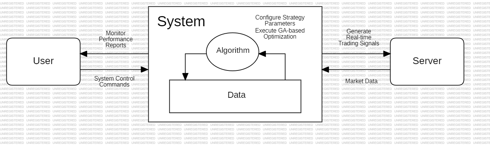

# 1. Conceptualization

**Project Title: OSS_Design_Adaptive-Trading-System** 

### [ Revision history ]
| Date | Version | Description | Author |
| :--- | :--- | :--- | :--- |
| 2026-03-27 | 1.0.0 | Initial Draft | 허주호 |
| 2026-03-28 | 1.1.0 | Add and edit content | 허주호 |
---

### 1. Business purpose

> **Project background, motivation, Goal, Target market etc.**

* **Background & Motivation**: 암호화폐 선물 시장은 24시간 운영되며 변동성이 매우 큼. 기존의 정적인 자동 매매 시스템은 급변하는 시장 추세에 유연하게 대응하지 못해 수익성이 저하되는 한계가 있음.
* **Goal**: 바이낸스(Binance) API를 활용해 실시간 데이터를 수집하고, **유전 알고리즘(Genetic Algorithm)**을 통해 매매 파라미터를 스스로 최적화하는 '지능형 적응 매매 엔진'을 구축함.
* **Target market**: 감정을 배제한 데이터 기반 투자를 원하는 개인 투자자 및 시스템 트레이딩 개발자.

---

### 2. System context diagram

* **User**: 사용자
* **System**: 프로그램 본체
* **Server**: 거래소 서버
* **Algorithm**: 핵심 로직
* **Data**: 저장 장소
* **Monitor Performance Reports**: 성과 보고서
* **System Control Commands**: 제어 명령
* **Configure Strategy Parameters**: 전략 설정 과정
* **Execute GA-based Optimization**: 최적화 과정
* **Generate Real-time Trading Signals**: 신호 생성 과정
* **Market Data**: 시세 데이터 공급

---

### 3. Use case list

| No | Use Case | Actor | Description |
| :--- | :--- | :--- | :--- |
| 1 | **Configure Strategy Parameters** | User | 가동 전 API Key, Symbol, Leverage 등 전략 구동에 필요한 필수 변수값들을 입력함. |
| 2 | **System Control Commands** | User | 엔진의 시작 및 정지 등 실시간 운영 상태를 제어하기 위한 명령을 시스템에 전달함. |
| 3 | **Execute GA-based Optimization** | System | 내부 **Algorithm**이 **Data**를 바탕으로 유전 알고리즘을 구동하여 최적 파라미터를 도출함. |
| 4 | **Generate Real-time Trading Signals** | System | 실시간 데이터를 분석하여 매수/매도 타점을 포착하고 이를 **Server**에 주문 신호로 전송함. |
| 5 | **Market Data Acquisition** | Server | 금융 시장의 실시간 가격 및 거래량 정보를 시스템 내부의 **Data** 영역으로 전송함. |
| 6 | **Monitor Performance Reports** | User | 시스템이 제공하는 시각화된 보고서를 통해 실시간 투자 성과와 매매 결과 현황을 파악함. |

---

### 4. Concept of operation

| No | Process | Purpose | Approach | Dynamics | Goals |
| :--- | :--- | :--- | :--- | :--- | :--- |
| 1 | **Configure Parameters** | 필수 변수값 설정 | 사용자가 API Key, 종목 등을 입력하여 운용 환경을 세팅함. | 시스템 실행 초기 단계 | 기초 변수 데이터 확보 |
| 2 | **System Control** | 운영 상태 제어 | Start/Stop 명령을 통해 알고리즘 가동 여부를 결정함. | 실시간 운영 중 제어 시 | 엔진의 완전한 통제권 확보 |
| 3 | **GA Optimization** | 최적 파라미터 도출 | **Algorithm**이 과거 데이터를 기반으로 유전 연산을 수행함. | 주기적 또는 요청 시 | 시장 적응형 전략 수립 |
| 4 | **Trading & Data** | 매매 실행 및 수집 | **Market Data**를 분석하여 주문 신호를 생성하고 서버에 전송함. **슬리피지(Slippage)** 최소화를 위한 시장가/지정가 최적 주문 로직을 적용함. | 데이터 수신 및 조건 충족 시 | 지연 없는 매매 체결 및 체결 오차 최소화 |
| 5 | **Performance Report** | 매매 성과 피드백 | 성과 데이터를 분석하여 시각화된 분석 보고서를 제공함. | 성과 확인 및 모니터링 시 | 투자 수익률 및 리스크 파악 |

---

### 5. Problem statement

시스템은 시장 데이터를 정밀하게 분석하여 최적의 매매 전략을 도출하고, 이를 바탕으로 실시간 자동 매매를 수행할 수 있어야 함.

#### 5.1 데이터 분석 및 최적화
시스템의 핵심 기능은 시장 데이터를 분석하고 최적의 파라미터를 도출하는 것임. 데이터에는 OHLCV와 같은 기초 수치와 기술적 지표가 포함되는데 기초 데이터는 **Server**로부터 수집되어 쉽게 확보할 수 있으나, 이를 바탕으로 시장에 적합한 '파라미터'를 찾는 것이 중요함. **Algorithm**은 유전 알고리즘을 통해 수많은 조합 중 수익률이 극대화된 파라미터를 탐지해야 하며, 이 연산 과정은 시스템 부하를 최소화하면서도 정확하게 수행되어야 함

#### 5.2 실시간 신호 포착 및 실행
시스템은 신속한 매매 신호 생성 및 주문 실행 기능을 제공해야 함. 실시간으로 수신되는 **Market Data**를 지연 없이 분석하여 매수/매도 타점을 포착해야 하며, 이를 **Server**에 전송하여 실제 체결로 연결하는 과정에서 오차를 최소화해야 함. 특히 바이낸스 API의 호출 제한(Rate Limit)을 준수하면서도 결정적인 매매 순간을 놓치지 않는 신속성이 요구됨.

#### 5.3 전략의 유효성 및 과적합 방지
시스템은 과거 데이터에만 치중하여 실제 매매에서 손실을 보는 과적합(Overfitting) 문제를 해결해야 함. 이를 위해 단순히 수익률이 높은 결과만 찾는 것이 아니라, **Walk-Forward** 분석 등을 통해 전략의 지속 가능성을 검증해야 함. 분류된 전략 파라미터는 현재 시장의 변동성 범위에 따라 유동적으로 갱신되어야 하며, 최종 성과는 **User**가 신뢰할 수 있는 데이터로 증명되어야 함.

#### 5.4 운영 편의성 및 보안
시스템 인터페이스는 사용자의 직관적인 운영을 고려하여 제작되어야 함. "Simple is best" 원칙에 따라 복잡한 내부 연산 과정은 은닉하고, **User**에게는 엔진의 Start/Stop 상태와 핵심 성과 지표(MDD, ROI 등)만을 명확하게 시각화하여 제공해야 함. 또한, 바이낸스 API Key와 같은 민감한 정보는 환경 변수 관리를 통해 외부 유출로부터 철저히 보호되어야 함.

---

### 6. Glossary

* **API Security (Environment Variables, .env)**: 시스템 운영에 필요한 민감한 정보(API Key, Secret Key 등)를 코드 내부에 직접 노출하지 않고 별도의 환경 변수 파일에 저장하여 관리하는 보안 기법.
* **Backtesting (백테스팅)**: 실제 매매 전, 과거 시장 데이터를 바탕으로 전략을 가상으로 실행하여 해당 로직의 유효성과 수익성을 검증하는 과정.
* **GA (Genetic Algorithm, 유전 알고리즘)**: 생물의 진화 및 유전 원리를 모방하여 수많은 파라미터 조합 중 최적의 해를 찾아가는 탐색 알고리즘.
* **GPL v3.0 (GNU General Public License v3.0)**: 강력한 카피레프트(Copyleft) 오픈소스 라이선스. 소프트웨어의 자유로운 사용과 수정을 보장하되, 이를 활용한 2차 저작물도 동일한 라이선스로 공개해야 함.
* **MDD (Maximum Drawdown, 최대 낙폭)**: 특정 운용 기간 중 전고점 대비 발생한 최대 손실폭을 의미하며, 전략의 리스크를 측정하는 핵심 지표.
* **OHLCV (Open-High-Low-Close-Volume)**: 시가, 고가, 저가, 종가, 거래량의 약자로 금융 시장 시세 데이터의 기본 단위.
* **Overfitting (과적합)**: 모델이 과거 데이터에만 지나치게 최적화되어, 실제 실시간 매매(미래 데이터) 환경에서 성능이 급격히 저하되는 현상.
* **Rate Limit (호출 제한)**: 거래소 API에서 단위 시간당 보낼 수 있는 요청 횟수를 제한하는 규칙. 초과 시 IP 차단 등의 불이익이 발생할 수 있음.
* **ROI (Return on Investment, 투자 수익률)**: 투자 대비 발생한 순이익의 비율로, 본 시스템의 전략 효율성을 평가하는 기초적인 정량 지표.
* **Slippage (슬리피지)**: 주문 시점의 가격과 실제 체결된 가격 사이의 차이. 변동성이 크거나 거래량이 적은 시장에서 주로 발생함.
* **WFO (Walk-Forward Optimization, 전진 분석 최적화)**: 과거 데이터의 학습 구간과 검증 구간을 일정 간격으로 이동시키며 전략의 실효성을 연속적으로 분석하는 기법.

---

### 7. References

* Binance API Documentation: https://binance-docs.github.io/apidocs/
* Pandas-ta Library: https://github.com/twopirllc/pandas-ta (https://pypi.org/project/pandas-ta/ - 안 들어가질 시 참고 사항)
