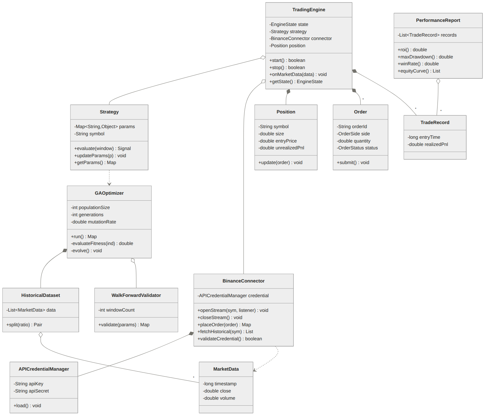
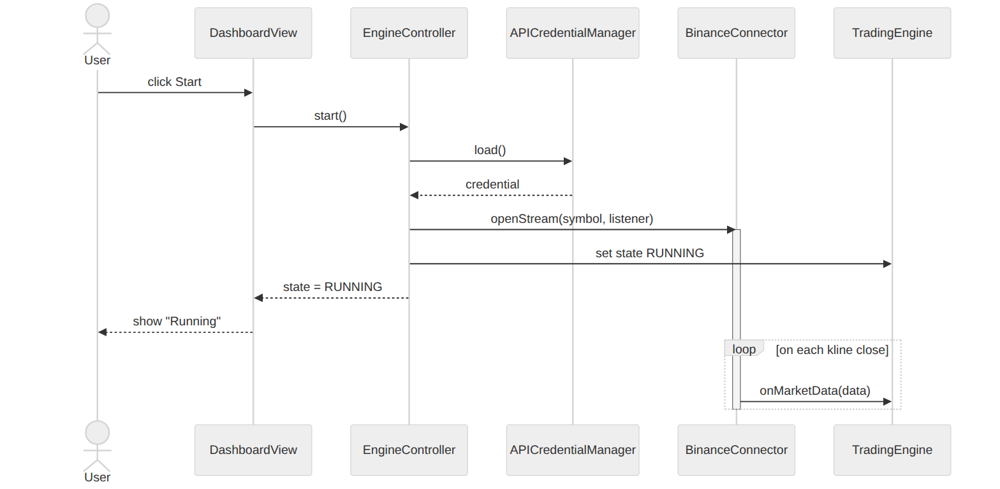
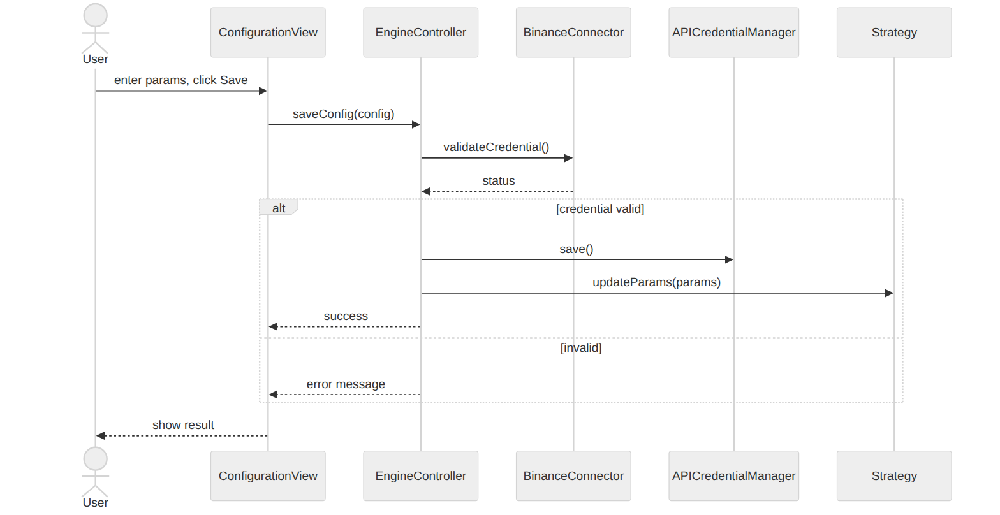
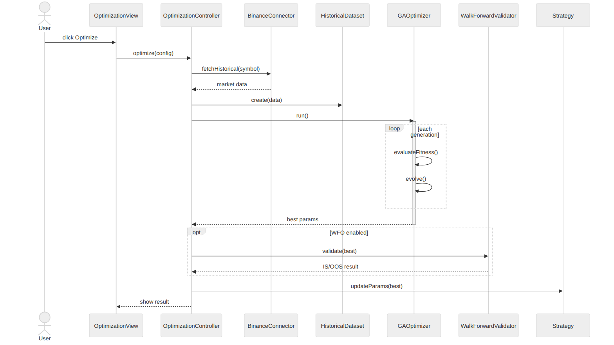
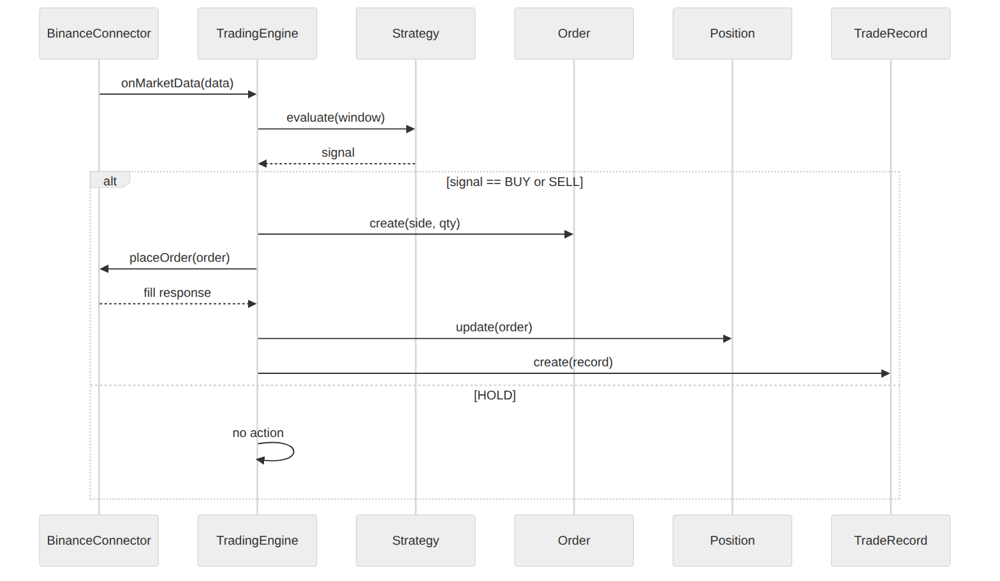
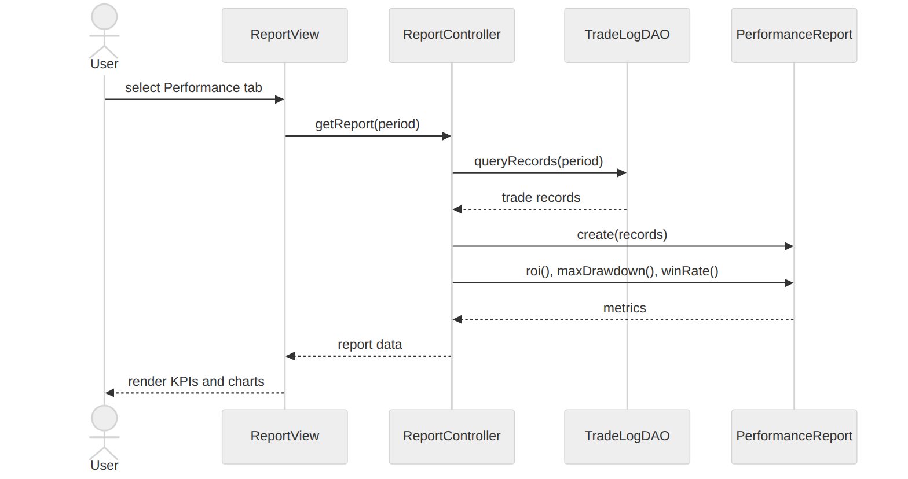
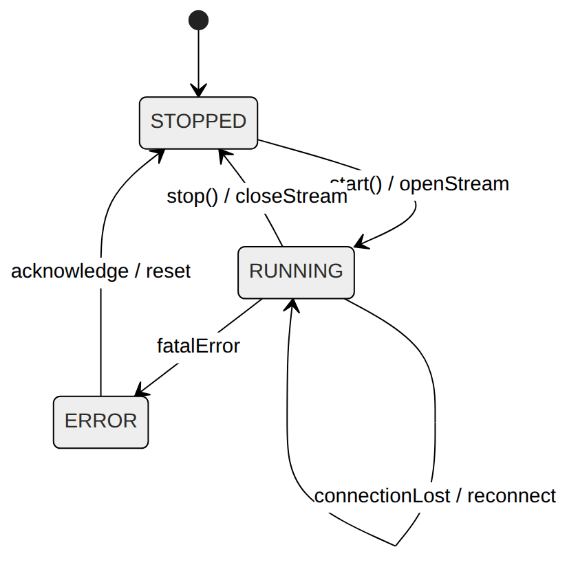
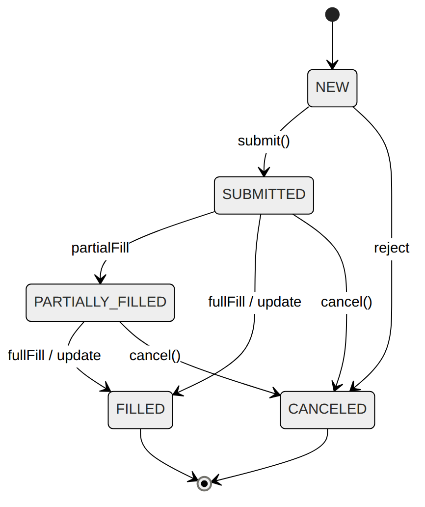

# 3. Design

**Project Title: OSS_Design_Adaptive-Trading-System**

### [ Revision history ]
| Date | Version | Description | Author |
| :--- | :--- | :--- | :--- |
| 2026-06-05 | 1.0.0 | Initial Draft | 허주호 |

---

= Contents =

1. Introduction
2. Class diagram
   2.1 Architecture overview
   2.2 Class diagram description
3. Sequence diagram
4. State machine diagram
5. Implementation requirements
6. Glossary
7. References

---

## 1. Introduction

본 문서는 ATS(Adaptive Trading System) 프로젝트의 세 번째 문서인 Design 단계 보고서임. Analysis 단계에서 정의한 use case와 domain class를 출발점으로, 실제 구현이 가능한 수준까지 설계를 구체화하는 것이 목적임.

Design은 SRUP에 따라 두 가지 활동으로 나뉨. 하나는 시스템 전체의 구조를 잡는 **system design**(아키텍처·레이어 설계)이고, 다른 하나는 각 클래스를 프로그래밍 언어 문법 수준으로 상세화하는 **object design**임. 이 문서에서는 layered architecture를 먼저 제시하고, 그 위에서 각 design class의 field와 method를 Java 문법으로 정의함. 이어서 주요 use case별 sequence diagram으로 객체 간 상호작용을 보이고, 상태를 갖는 핵심 클래스에 대해 state machine diagram을 작성함. 마지막으로 구현에 필요한 환경 요구사항을 정리함.

Analysis와의 핵심 차이는 구체성임. Analysis의 domain class가 "어떤 객체가 존재하는가"였다면, Design의 design class는 field의 타입, method의 인자·반환형·가시성까지 명시하여 StarUML이 Java 코드 템플릿을 생성할 수 있는 수준으로 정밀함.

---

## 2. Class diagram

### 2.1 Architecture overview

ATS는 4계층 layered architecture로 설계함. 상위 계층은 하위 계층에만 의존하며, 역방향 의존은 허용하지 않음.

| Layer | 역할 | 주요 클래스 |
| :--- | :--- | :--- |
| **Presentation** | 사용자 입력/출력 (GUI) | DashboardView, ConfigurationView, OptimizationView, ReportView |
| **Control** | use case 흐름 조율 | EngineController, OptimizationController, ReportController |
| **Domain** | 핵심 비즈니스 로직 | TradingEngine, Strategy, GAOptimizer, Order, Position, MarketData, TradeRecord, PerformanceReport, WalkForwardValidator, HistoricalDataset |
| **Infrastructure** | 외부 통신·영속화 | BinanceConnector, APICredentialManager, TradeLogDAO, HistoricalDataDAO |

`<그림 2-1> ATS Design Class Diagram`

> **참고**: 단순히 값을 보관하는 데이터 클래스(`MarketData`, `Order`, `Position`, `TradeRecord`)는 field 위주이고 로직이 적으므로 상세 표를 간략히 다룸. 로직을 가진 핵심 클래스(`TradingEngine`, `Strategy`, `GAOptimizer`, `BinanceConnector`, `PerformanceReport`)는 field/method를 모두 상세히 기술함.

### 2.2 Class diagram description

각 클래스의 field와 method를 표 형식으로 정의함. Scope는 instance/class(static), Visibility는 Java 키워드(public/private/protected)를 따름.

---

#### Enumerations

설계 전반에서 사용하는 열거형 타입을 먼저 정의함.

| Enum | Values | Description |
| :--- | :--- | :--- |
| `EngineState` | `STOPPED`, `RUNNING`, `ERROR` | TradingEngine의 가동 상태 |
| `Signal` | `BUY`, `SELL`, `HOLD` | Strategy가 산출하는 매매 신호 |
| `OrderSide` | `BUY`, `SELL` | 주문 방향 |
| `OrderType` | `MARKET`, `LIMIT` | 주문 유형 |
| `OrderStatus` | `NEW`, `SUBMITTED`, `PARTIALLY_FILLED`, `FILLED`, `CANCELED` | 주문 체결 상태 |

---

#### TradingEngine

**Class Description**: 시스템 전체의 가동 상태를 관리하는 핵심 오케스트레이터. Start/Stop 명령을 받아 데이터 수신 루프와 신호 생성 루프를 제어함.

**Fields**

| Name | Type | Scope | Visibility | Description |
| :--- | :--- | :--- | :--- | :--- |
| `state` | EngineState | instance | private | 현재 엔진 상태 (STOPPED/RUNNING/ERROR) |
| `strategy` | Strategy | instance | private | 현재 활성 전략 |
| `connector` | BinanceConnector | instance | private | 거래소 통신 객체 |
| `position` | Position | instance | private | 현재 보유 포지션 (없으면 null) |
| `signalThread` | Thread | instance | private | 신호 생성 루프 스레드 |

**Methods**

| Name | Argument | Returns | Scope | Visibility | Description |
| :--- | :--- | :--- | :--- | :--- | :--- |
| `TradingEngine` | Strategy, BinanceConnector | — | instance | public | 생성자. 멤버 초기화, 상태를 STOPPED로 설정 |
| `start` | — | boolean | instance | public | 엔진 가동. 데이터 수신·신호 루프 시작 |
| `stop` | — | boolean | instance | public | 엔진 정지. 루프 종료 및 스트림 닫기 |
| `onMarketData` | MarketData | void | instance | public | 신규 데이터 수신 시 호출되는 콜백 |
| `getState` | — | EngineState | instance | public | 현재 상태 반환 |

---

#### Strategy

**Class Description**: 매매 전략과 파라미터를 보유하고, 시장 데이터에 대해 매매 신호를 산출하는 클래스.

**Fields**

| Name | Type | Scope | Visibility | Description |
| :--- | :--- | :--- | :--- | :--- |
| `params` | Map\<String, Object\> | instance | private | 지표 설정값 (RSI period, MA 기간 등) |
| `symbol` | String | instance | private | 거래 종목 (예: BTCUSDT) |
| `indicators` | Map\<String, Object\> | instance | private | 계산된 기술적 지표 캐시 |

**Methods**

| Name | Argument | Returns | Scope | Visibility | Description |
| :--- | :--- | :--- | :--- | :--- | :--- |
| `Strategy` | Map\<String,Object\>, String | — | instance | public | 생성자. 파라미터·종목으로 전략 생성 |
| `evaluate` | List\<MarketData\> | Signal | instance | public | 데이터 윈도우로 매수/매도/홀드 신호 산출 |
| `updateParams` | Map\<String,Object\> | void | instance | public | GA 결과로 파라미터 갱신 |
| `getParams` | — | Map\<String,Object\> | instance | public | 현재 파라미터 반환 |

---

#### GAOptimizer

**Class Description**: 유전 알고리즘으로 최적 전략 파라미터를 탐색하는 클래스. 모집단 관리, 적합도 평가, 선택·교차·돌연변이를 수행함.

**Fields**

| Name | Type | Scope | Visibility | Description |
| :--- | :--- | :--- | :--- | :--- |
| `populationSize` | int | instance | private | 한 세대 개체 수 |
| `generations` | int | instance | private | 총 세대 수 |
| `mutationRate` | double | instance | private | 돌연변이 확률 |
| `dataset` | HistoricalDataset | instance | private | 적합도 평가용 과거 데이터 |
| `population` | List\<Map\<String,Object\>\> | instance | private | 현재 세대 파라미터 집합 |

**Methods**

| Name | Argument | Returns | Scope | Visibility | Description |
| :--- | :--- | :--- | :--- | :--- | :--- |
| `GAOptimizer` | int, int, double, HistoricalDataset | — | instance | public | 생성자. GA 설정 초기화 |
| `run` | — | Map\<String,Object\> | instance | public | 최적화 실행, 최적 파라미터 반환 |
| `evaluateFitness` | Map\<String,Object\> | double | instance | private | 한 개체의 적합도(ROI - λ·MDD) 계산 |
| `evolve` | — | void | instance | private | 선택·교차·돌연변이로 다음 세대 생성 |

---

#### BinanceConnector

**Class Description**: 바이낸스 거래소와의 통신을 추상화. REST(주문·계좌)와 WebSocket(실시간 시세)을 모두 다루며 rate limit·재연결을 관리함.

**Fields**

| Name | Type | Scope | Visibility | Description |
| :--- | :--- | :--- | :--- | :--- |
| `credential` | APICredentialManager | instance | private | 인증 정보 관리 객체 |
| `wsClient` | WebSocketClient | instance | private | 실시간 스트림 클라이언트 |
| `restClient` | RestClient | instance | private | REST API 클라이언트 |

**Methods**

| Name | Argument | Returns | Scope | Visibility | Description |
| :--- | :--- | :--- | :--- | :--- | :--- |
| `BinanceConnector` | APICredentialManager | — | instance | public | 생성자. 클라이언트 초기화 |
| `openStream` | String, MarketDataListener | void | instance | public | WebSocket 스트림 개통, 리스너 등록 |
| `closeStream` | — | void | instance | public | 스트림 정상 종료 |
| `placeOrder` | Order | Map\<String,Object\> | instance | public | REST로 주문 제출, 체결 응답 반환 |
| `fetchHistorical` | String, String, int | List\<MarketData\> | instance | public | 과거 OHLCV 데이터 조회 |
| `validateCredential` | — | boolean | instance | public | API Key 유효성 검증 (ping/account) |

---

#### PerformanceReport

**Class Description**: TradeRecord 모음을 집계하여 ROI, MDD, 승률 등 성과 지표를 산출하는 클래스.

**Fields**

| Name | Type | Scope | Visibility | Description |
| :--- | :--- | :--- | :--- | :--- |
| `records` | List\<TradeRecord\> | instance | private | 집계 대상 거래 기록 |

**Methods**

| Name | Argument | Returns | Scope | Visibility | Description |
| :--- | :--- | :--- | :--- | :--- | :--- |
| `PerformanceReport` | List\<TradeRecord\> | — | instance | public | 생성자. 거래 기록으로 리포트 생성 |
| `roi` | — | double | instance | public | 투자 수익률 계산 |
| `maxDrawdown` | — | double | instance | public | 최대 낙폭 계산 |
| `winRate` | — | double | instance | public | 승률 계산 |
| `sharpeRatio` | — | double | instance | public | 샤프 지수 계산 |
| `equityCurve` | — | List\<Double\> | instance | public | 자본곡선 데이터 반환 |

---

#### Control 계층 (간략)

컨트롤러는 use case 흐름을 조율하며, 주요 method만 정리함.

**EngineController**: `start(): void` (엔진 가동 흐름), `stop(): void`, `saveConfig(Map<String,Object> config): boolean` (설정 저장 + 자격증명 검증).

**OptimizationController**: `optimize(Map<String,Object> config): void` (과거 데이터 수집 → GA 실행 → 전략 반영).

**ReportController**: `getReport(String period): PerformanceReport` (거래 기록 조회 → 리포트 생성).

---

#### 데이터 클래스 (간략)

아래 클래스들은 주로 값을 보관하므로 핵심 field만 정리함. 각 field는 private이며 getter/setter로 접근함.

**MarketData**: `timestamp: long`, `open: double`, `high: double`, `low: double`, `close: double`, `volume: double`. OHLCV 한 단위를 표현.

**Order**: `orderId: String`, `side: OrderSide`, `type: OrderType`, `quantity: double`, `price: double`, `status: OrderStatus`. 단일 주문을 표현. `submit(): void` 메서드로 상태 전이.

**Position**: `symbol: String`, `size: double`, `entryPrice: double`, `unrealizedPnl: double`, `leverage: int`. 현재 포지션을 표현. `update(Order): void` 제공.

**TradeRecord**: `entryTime: long`, `exitTime: long`, `entryPrice: double`, `exitPrice: double`, `quantity: double`, `realizedPnl: double`. 체결 완료된 거래 1건.

**HistoricalDataset**: `data: List<MarketData>`. `split(double trainRatio): Pair<List<MarketData>, List<MarketData>>` 메서드로 학습/검증 구간 분할 제공.

**WalkForwardValidator**: `windowCount: int`. `validate(Map<String,Object> params): Map<String,Object>` 메서드로 IS/OOS 성과 비교 결과 반환.

**APICredentialManager**: `apiKey: String`, `apiSecret: String` (모두 private). `.env`(또는 properties)에서 로드하며 외부 노출 차단.

---

## 3. Sequence diagram

Analysis 단계의 use case를 design class 수준의 객체 상호작용으로 구체화함. 각 다이어그램은 use case realization에 해당함.

### 3.1 Start Trading Engine

`<그림 3-1> Sequence Diagram : Start Trading Engine`

사용자가 Dashboard에서 Start를 누르면 `EngineController.start()`가 호출됨. 컨트롤러는 `APICredentialManager`로 자격증명을 로드하고 `Strategy`를 준비한 뒤, `BinanceConnector.openStream()`으로 WebSocket을 개통함. 이후 시세가 들어올 때마다 `TradingEngine.onMarketData()`가 콜백으로 실행되며, 상태가 `RUNNING`으로 갱신되어 Dashboard에 반영됨.

### 3.2 Configure Strategy Parameters (Validate 포함)

`<그림 3-2> Sequence Diagram : Configure Strategy Parameters`

사용자가 입력값을 저장하면 `ConfigurationView`가 `EngineController.saveConfig()`를 호출하고, 컨트롤러는 `BinanceConnector.validateCredential()`을 호출하여 API Key를 검증함(«include» Validate API Credentials). 200 OK가 반환되면 `APICredentialManager`가 `.env`에 저장하고 `Strategy.updateParams()`로 파라미터를 반영함. 검증 실패 시 오류 메시지를 반환하고 저장을 중단함.

### 3.3 Run GA Optimization

`<그림 3-3> Sequence Diagram : Run GA Optimization`

사용자가 Optimize를 누르면 `OptimizationController.optimize()`가 `BinanceConnector.fetchHistorical()`로 과거 데이터를 받아 `HistoricalDataset`을 구성함. 이어 `GAOptimizer.run()`이 세대마다 `evaluateFitness()`로 적합도를 계산하고 `evolve()`로 다음 세대를 생성하는 루프를 반복함. WFO 옵션이 켜진 경우 `WalkForwardValidator.validate()`로 재검증함(«extend»). 최종적으로 최적 파라미터를 `Strategy.updateParams()`에 반영하고 결과를 화면에 표시함.

### 3.4 Generate Trading Signal & Place Order

`<그림 3-4> Sequence Diagram : Generate Trading Signal → Place Order`

신규 kline이 close되면 `TradingEngine.onMarketData()`가 `Strategy.evaluate()`를 호출하여 신호를 산출함. BUY/SELL 신호가 발생하면 `Order` 객체를 생성하고 잔고를 검증한 뒤 `BinanceConnector.placeOrder()`로 거래소에 전송함(«include»). 체결 응답을 받으면 `Position`과 `TradeRecord`를 갱신함. HOLD 신호면 No-Action으로 종료함.

### 3.5 Monitor Performance Reports

`<그림 3-5> Sequence Diagram : Monitor Performance Reports`

사용자가 Performance 탭을 선택하면 `ReportController.getReport()`가 `TradeLogDAO`에서 거래 기록을 조회하여 `PerformanceReport`를 생성함. 리포트 객체는 `roi()`, `maxDrawdown()`, `winRate()`, `equityCurve()`를 계산하고, `ReportView`가 KPI와 차트를 렌더링함.

---

## 4. State machine diagram

상태를 갖는 핵심 클래스 두 개에 대해 state machine diagram을 작성함. 모든 상태와 전이는 class diagram·sequence diagram과 일관됨.

### 4.1 TradingEngine

`<그림 4-1> State Machine Diagram : TradingEngine`

`TradingEngine`은 세 가지 상태를 가짐.

* **STOPPED** (초기 상태): 엔진이 정지된 상태. `start()` 호출 시 RUNNING으로 전이.
* **RUNNING**: 데이터 수신·신호 생성 루프가 동작 중인 상태. 내부적으로 시세 수신(`onMarketData`)이 반복됨. `stop()` 호출 시 STOPPED로 전이.
* **ERROR**: 연결 실패·API 오류 등으로 정상 동작이 불가능한 상태. RUNNING에서 예외 발생 시 진입하며, 사용자 확인 후 STOPPED로 복귀.

전이 이벤트: `start() / openStream`, `stop() / closeStream`, `connectionLost / reconnect`, `fatalError`.

### 4.2 Order

`<그림 4-2> State Machine Diagram : Order`

`Order`는 거래소 체결 과정에 따라 다음 상태를 거침.

* **NEW** (초기 상태): 주문 객체가 생성되어 거래소에 제출 대기 중.
* **SUBMITTED**: 거래소에 전송되어 접수된 상태.
* **PARTIALLY_FILLED**: 일부 수량만 체결된 상태. 잔량은 계속 대기하거나 취소될 수 있음.
* **FILLED** (종료 상태): 전량 체결 완료. `Position`·`TradeRecord` 갱신을 트리거.
* **CANCELED** (종료 상태): 사용자 또는 시스템에 의해 취소됨.

전이 이벤트: `submit()`, `partialFill`, `fullFill`, `cancel()`, `reject`.

---

## 5. Implementation requirements

### 5.1 H/W platform requirements

* **CPU**: Intel i5 이상 (GA 연산이 CPU 집약적이므로 멀티코어 권장)
* **RAM**: 8GB 이상
* **Storage**: 10GB 이상 (과거 데이터 캐시 포함)
* **Network**: 안정적인 인터넷 연결 필수 (실시간 시세 수신·주문 전송)

### 5.2 S/W platform requirements

* **OS**: Windows 10 이상 / macOS / Linux (JVM 기반 크로스 플랫폼)
* **Implementation Language**: Java (JDK 17 LTS 이상)
* **Build Tool**: Gradle 또는 Maven
* **주요 라이브러리**:
  * `binance-connector-java`: 바이낸스 REST/WebSocket API 연동
  * `ta4j` (Technical Analysis for Java): 시세 데이터 처리 및 기술적 지표 계산
  * `Jenetics`: 유전 알고리즘 프레임워크
  * `Jackson` (또는 Gson): JSON 직렬화/역직렬화
  * `dotenv-java`: `.env` 기반 API Key 보안 관리
  * GUI: `JavaFX`
* **보안**: API Key/Secret은 코드에 하드코딩하지 않고 `.env`(또는 외부 properties) 환경 변수로 관리

---

## 6. Glossary

Analysis 단계까지의 용어는 그대로 유효하며, Design 단계에서 새로 등장한 용어만 정리함.

* **Class diagram**: 시스템의 정적 구조를 클래스와 그 관계로 표현한 UML 다이어그램.
* **Sequence diagram**: 객체 간 동적 상호작용을 시간 순서로 표현한 UML 다이어그램.
* **State machine diagram**: 한 객체가 생애 동안 가질 수 있는 상태와 상태 간 전이를 표현한 다이어그램.
* **Field (Attribute)**: 클래스가 보유하는 데이터(멤버 변수).
* **Method (Operation)**: 클래스가 수행하는 동작(멤버 함수).
* **Visibility**: 멤버의 접근 범위. public / protected / private.
* **Enumeration (enum)**: 고정된 상수 집합을 표현하는 타입.
* **Layered architecture**: 시스템을 책임에 따라 계층으로 나누고 상위→하위 단방향 의존만 허용하는 구조.
* **Use case realization**: 하나의 use case가 design class들의 협력으로 실제 구현되는 과정을 보인 설계.

---

## 7. References

* [1] Binance API Documentation: https://binance-docs.github.io/apidocs/
* [2] ta4j (Technical Analysis for Java): https://github.com/ta4j/ta4j
* [3] Jenetics (Java Genetic Algorithm Library): https://jenetics.io/
* [4] Bernd Bruegge, Allen H. Dutoit, *Object-Oriented Software Engineering: Using UML, Patterns, and Java*, 3rd edition, Pearson, 2010.
* [5] OMG, *Unified Modeling Language Specification (UML 2.5.1)*, Object Management Group, 2017.
* [6] StarUML 공식 문서: https://docs.staruml.io/
* [7] 강의자료: Structural Modeling, Behavior Modeling (CEM049).
* [8] CEM049 OSS Design Project Plan, Software Engineering Laboratory, Dept. of Computer Engineering, Yeungnam University, Spring 2026.
